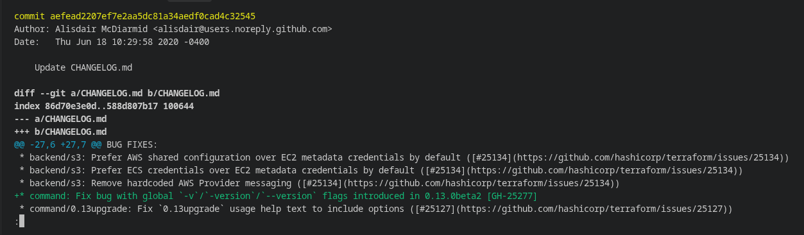
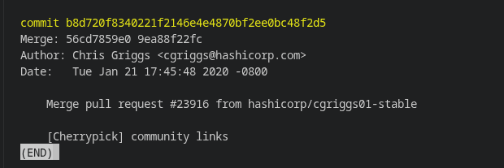
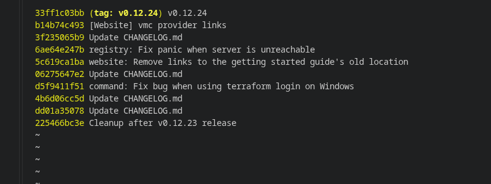
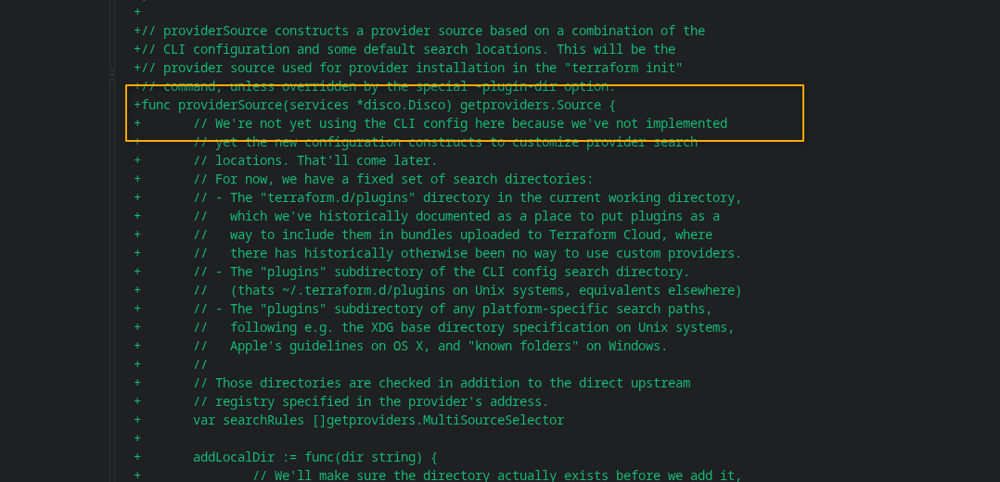
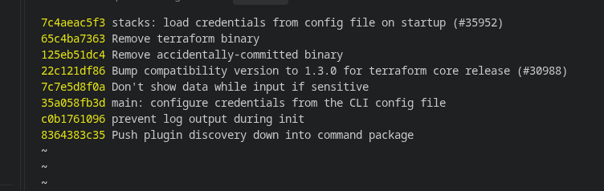

# Домашнее задание по теме «Системы контроля версий. Git» - Элдияр Акматов
 
**Репозиторий:** Terraform (https://github.com/hashicorp/terraform.git)
## Вопросы к заданию

1. Найдите полный хеш и комментарий коммита, хеш которого начинается на `aefea`.
2. Какому тегу соответствует коммит `85024d3`?
3. Сколько родителей у коммита `b8d720`? Напишите их хеши.
4. Перечислите хеши и комментарии всех коммитов, которые были сделаны между тегами `v0.12.23` и `v0.12.24`.
5. Найдите коммит, в котором была создана функция `func providerSource`, её определение в коде выглядит так: `func providerSource(...)`.
6. Найдите все коммиты, в которых была изменена функция `globalPluginDirs`.
7. Кто автор функции `synchronizedWriters`?

---

## Ответы на вопросы

### Ответ 1
* **Использованная команда:**
  `git show aefea`
* **Результат:**
  * **Полный хеш:** `aefead2207ef7e2aa5dc81a34aedf0cad4c32545`
  * **Комментарий:** ` Update CHANGELOG.md`
  

---

### Ответ 2
* **Использованная команда:**
  `git tag --points-at 85024d3`
* **Результат:**
  * **Тег:** `v0.12.23`

---

### Ответ 3
* **Использованные команды:**
  `git show --no-patch b8d720`
  `git rev-parse b8d720^1`
  `git rev-parse b8d720^2`
* **Результат:**
  * **Количество родителей:** 2
  * **Хеш 1-го родителя:** `56cd7859e05c36c06b56d013b55a252d0bb7e158`
  * **Хеш 2-го родителя:** `9ea88f22fc6269854151c571162c5bcf958bee2b`
  

---

### Ответ 4
* **Использованная команда:**
  `git log --oneline v0.12.23..v0.12.24`
* **Результат:**
  
  

---

### Ответ 5
* **Использованная команда:**
  `git log -S "func providerSource" --oneline`
* **Результат:**
  * **Хеш коммита:** `8c928e83589d90a031f811fae52a81be7153e82f`
  
  

---

### Ответ 6
* **Использованная команда:**
  `git log -S "globalPluginDirs" --oneline`
* **Результат:**
  
  

---

### Ответ 7
* **Использованные команды:**
  `git grep "synchronizedWriters" (пусто кстати)`
  `git log -S "synchronizedWriters" --oneline`
  `git show <найденный_хеш>`
* **Результат:**
  * **Автор:** Martin Atkins <mart@degeneration.co.uk>
  * **Коммит создания:** `5ac311e2a91e381e2f52234668b49ba670aa0fe5`